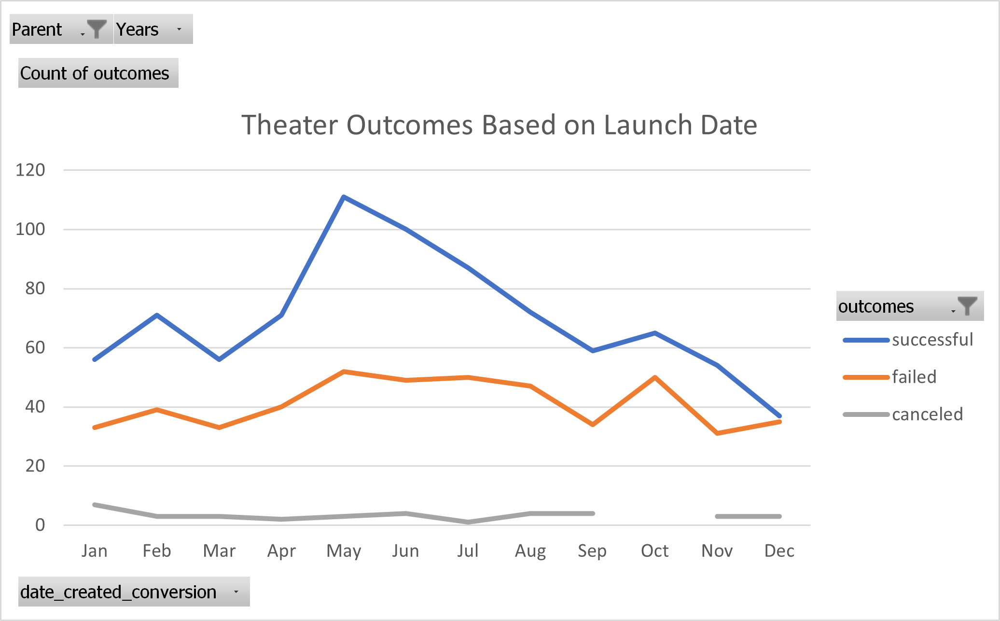
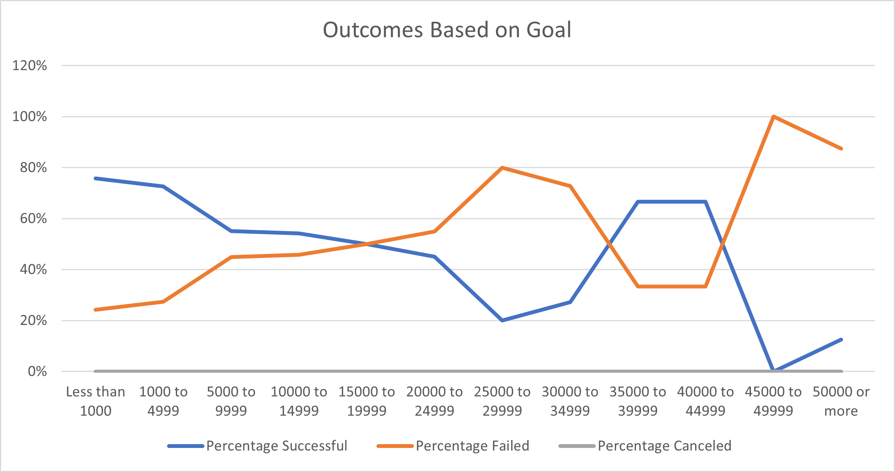

# Kickstarter Analysis

## Project Overview

The purpose of this project is to analyze a Kickstarter dataset using Excel to draw insights on how different fundraising campaigns fared in relation to their luanch dates and funding goals, and to convey those findings using simple graphs. In this analysis, we focused on campaigns related to theater and plays.

## Analysis and Challenges
The analysis uses a Kickstarter dataset containing fundraising outcome data from 4114 campaigns launched between 2009 to 2017. The campaigns span multiple  categories, countries, and currencies.

To make the data more useful, two adjustments had to be made before we can start the analysis:
1. The campaign launch and end dates in the raw data had to be converted into readable date format using Excel formulas
2. Categories had to be separated into parent and subcategories

The Excel data and summaries can be found here https://github.com/kristindong/kickstarter-analysis/blob/62e1976782ed354c171c9145852a2a6cb11caa58/Kickstarter_Challenge.zip

### Analysis of Outcomes Based on Launch Date
To show Theater outcomes by launch date, a pivot table was used to tabulate the theater campaign outcomes over all available data years. The data was grouped by calender month, and a simple line graph was used to help visualize the summary.

### Analysis of Outcomes Based on Goals
We are also interested in outcomes of fundraising for plays based on their funding goal amounts. To do this, we divided the data into 12 goal ranges and calculated the success, failure and cancel rates within each goal range. A graph of the outcome in percentages based on goal ranges is used to visualize the summary.

## Results
Two conclusions about the Outcomes based on Launch Date:
1. May had the highet number of successes compared to other months in the year
2. Successful campaigns generally increased from January to May but generally decreased for the rest of the year

One conclusions about the Outcomes based on Goals:
1. Success rate was highest for funding goals less than $5000 and generally decreases as goals get bigger

Some limitations of this dataset:
- Data is limited for goal amounts greater than $15000 
- Data spans 2009 to 2017 but earlier years may not be as relevant as more recent data

Other possible tables and/or graphs that can be created:
- Theatre outcomes by year and country
- Count of outcomes based on goal ranges using bar graphs
